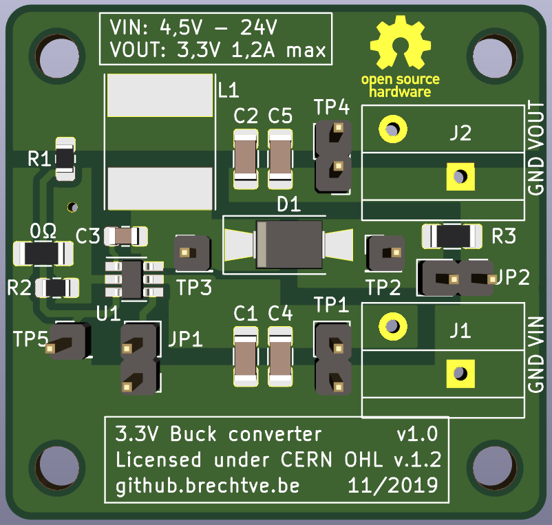
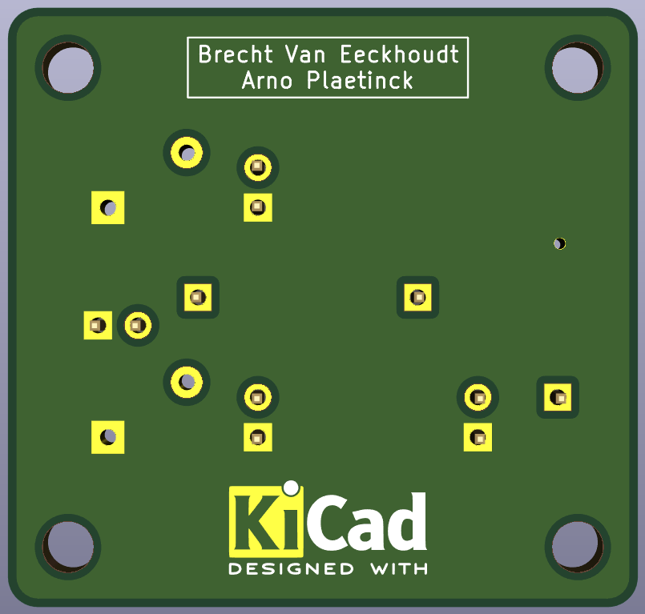
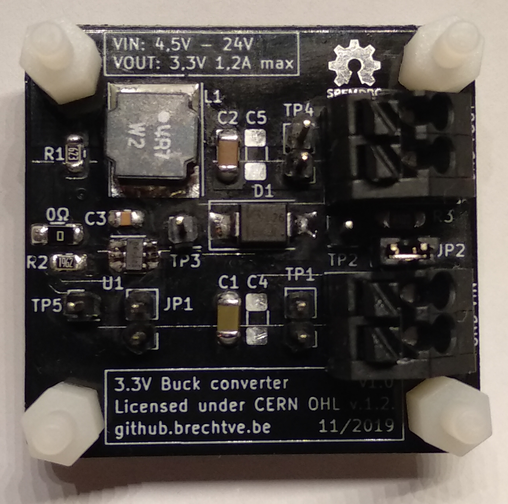

# Project-LabAnalogDesign2

 

The goal of this lab was to design a 5 - 9V to 3,3V (500 mA min) buck converter from the ground up. We had to start from a given chip (`RT8259GE`) and create the rest ourselves.

Careful layout considerations were taken to lead to an optimal design. The `0Ω` resistor is not on the schematic but only on the board layout. It's footprint was used to *jump* over the feedback track so everything is on the top layer. A via to GND is placed around it as well for redundancy.

- `JP1` can be used to disable the buck converter.
- `JP2` can be used to bypass the sense resistor `R3` (measures the diode current).
- A lot of test points (`TPx`) are given to be able to measure different voltages.
- `C4` and `C5` are footprints for extra capacitors if the signals have too much ripple.
<!-- fix vertical spacing -->
- VIN: 4,5 - 24 V
- VOUT: 3,3 V @ 1,2 A max
<!-- fix vertical spacing -->
- Click [here](hardware/dc-dc-3-3V-RT8259GE/dc-dc-3-3V-RT8259GE.pdf) to go to the **schematic**.
- Click [here](documentation/report/AnaloogOntwerp2-Labo-BuckConverter-Brecht-Arno.pdf) to go to the **report** (Dutch).

 

 &nbsp; &nbsp; 

 

## BOM

| Component | Value                       | Footprint     | Other               | Ordering                                                                                                                                         |
| --------- | --------------------------- | ------------- | ------------------- | ------------------------------------------------------------------------------------------------------------------------------------------------ |
| U1        | RT8259GE                    | SOT-23-6      | Richtek             |                                                                                                                                                  |
| C1, C4    | 10 µF                       | 1206          | (X7R), 50V, 10%     | [Mouser.be](https://www.mouser.be/ProductDetail/Taiyo-Yuden/UMK316BBJ106KL-T?qs=sGAEpiMZZMs0AnBnWHyRQC2E6Mcmylam9RgrENSytztpBCepHfvewA%3D%3D)    |
| C2, C5    | 22 µF                       | 1206          | X7R, 10V, 10%       | [Mouser.be](https://www.mouser.be/ProductDetail/Taiyo-Yuden/LMK316AB7226KL-TR?qs=sGAEpiMZZMs0AnBnWHyRQNbg85K4ab%2F3vBf6FXuF68A%3D)               |
| C3        | 10 nF = 0,01 µF             | 0805          | X7R, 50V, 10%       | [Mouser.be](https://www.mouser.be/ProductDetail/Wurth-Elektronik/885012207092?qs=sGAEpiMZZMs0AnBnWHyRQEGbLOF2VP1iBKezlgXLZvo%2F8tItKANG8A%3D%3D) |
| D1        | If = 2A Vr = 40V Vf = 0,43V | SMA/SMB       |                     | [Mouser.be](https://www.mouser.be/ProductDetail/ON-Semiconductor/MBRS2040LT3G?qs=sGAEpiMZZMtQ8nqTKtFS%2FCKUxMvjsmGzEfxVIbeME%2FY%3D)             |
| L1        | 4,7 µH                      | NR8040        | Taiyo Yuden         | [Mouser.be](https://www.mouser.be/ProductDetail/Taiyo-Yuden/NR8040T4R7N?qs=sGAEpiMZZMsg%252By3WlYCkU5iuzh4MJmq0qQohkARpSRw%3D)                   |
| R1        | 62 kΩ                       | 0805          | 0,5%                | [Mouser.be](https://www.mouser.be/ProductDetail/Susumu/RR1220P-623-D?qs=sGAEpiMZZMtlubZbdhIBIIeqUIwQIz3%2F4suNfbqaJx0%3D)                        |
| R2        | 19,6 kΩ                     | 0805          | 0,5%                | [Mouser.be](https://www.mouser.be/ProductDetail/Susumu/RR1220P-1962-D-M?qs=sGAEpiMZZMtlubZbdhIBIIeqUIwQIz3%2FtET9VVF0mUY%3D)                     |
| R3        | 0,1 Ω = 100 mΩ              | 1206          | 1%                  | [Mouser.be](https://www.mouser.be/ProductDetail/Ohmite/KDV12FR100ET?qs=sGAEpiMZZMtlubZbdhIBIFv9D87cWnlaxTC7ytBtffo%3D)                           |
| 0Ω        | 0 Ω                         | 1206          |                     | [Mouser.be](https://www.mouser.be/ProductDetail/Yageo/RC1206JR-070RL?qs=sGAEpiMZZMtlubZbdhIBIMHu9P6GKOabM4IOLvph3MY%3D)                          |
| J1, J2    | PTSA_1,5/_2-3,5-Z_BK        | Pitch: 3,5 mm | 2 contacts, 250V 2A | [Mouser.be](https://www.mouser.be/ProductDetail/Phoenix-Contact/1751765?qs=sGAEpiMZZMvZTcaMAxB2AOnzhHajZlLEGRULH%2FxUGnk%3D)                     |

> **WARNING:** The pinout of J1 and J2 is reversed due to a footprint error (wrong top/bottom view). The Phoenix Contact connectors can however be manually separated and put back together in a way that they do fit on the board.